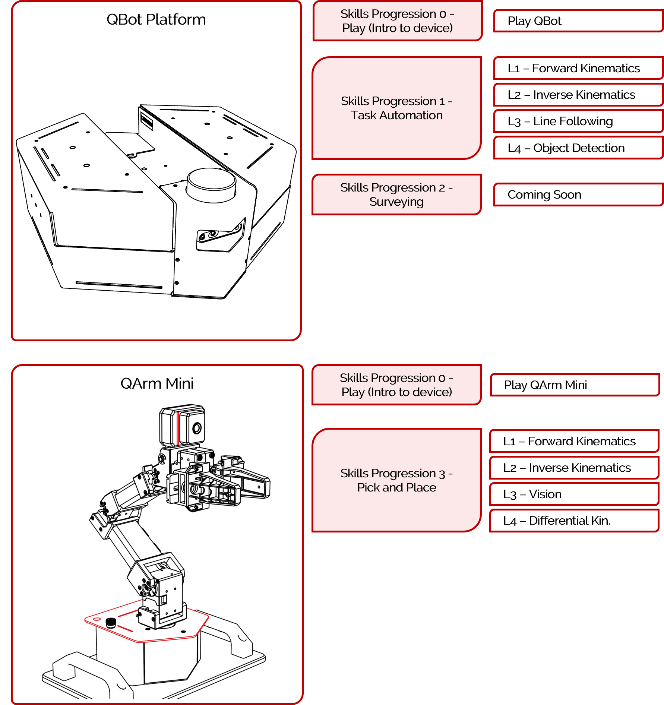
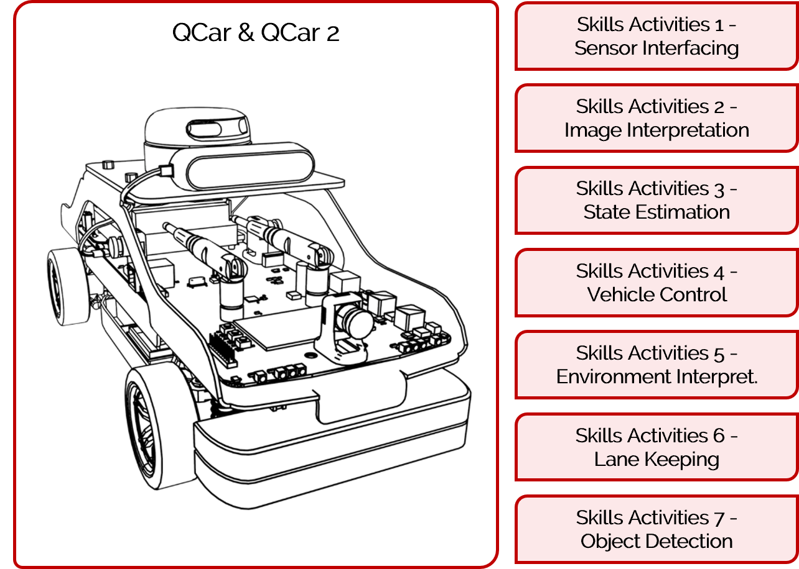
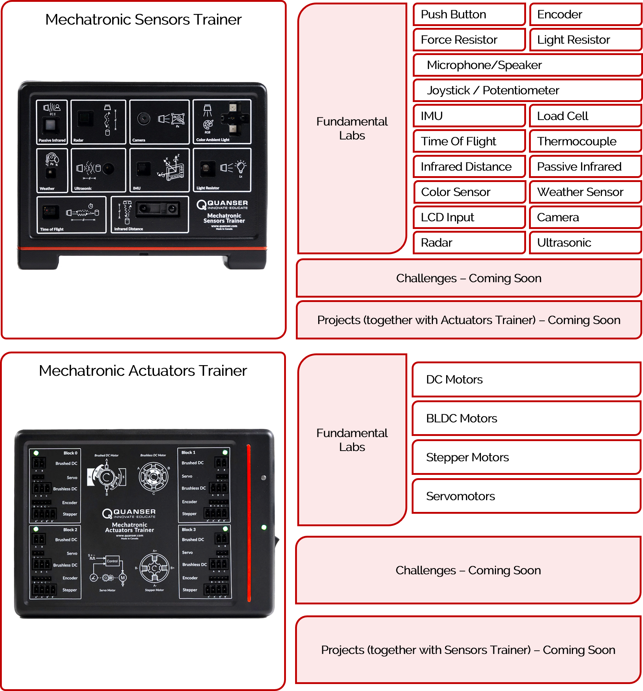
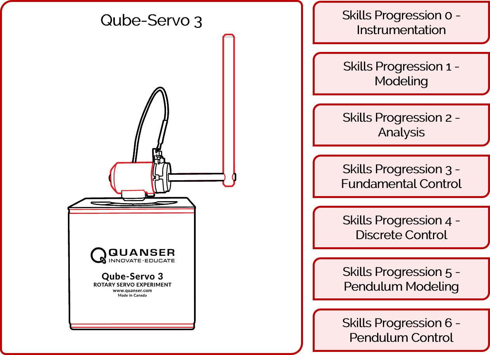
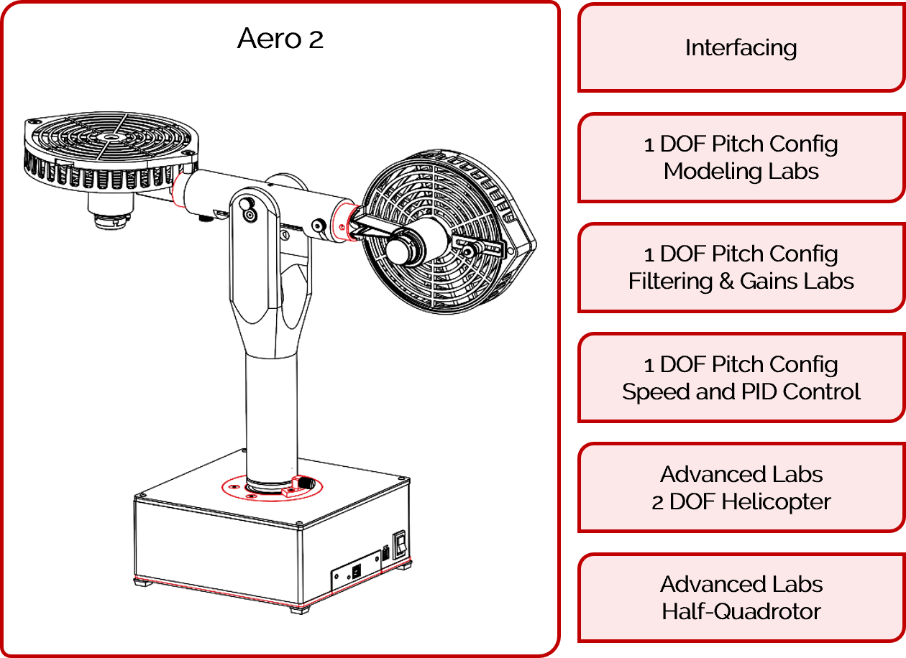
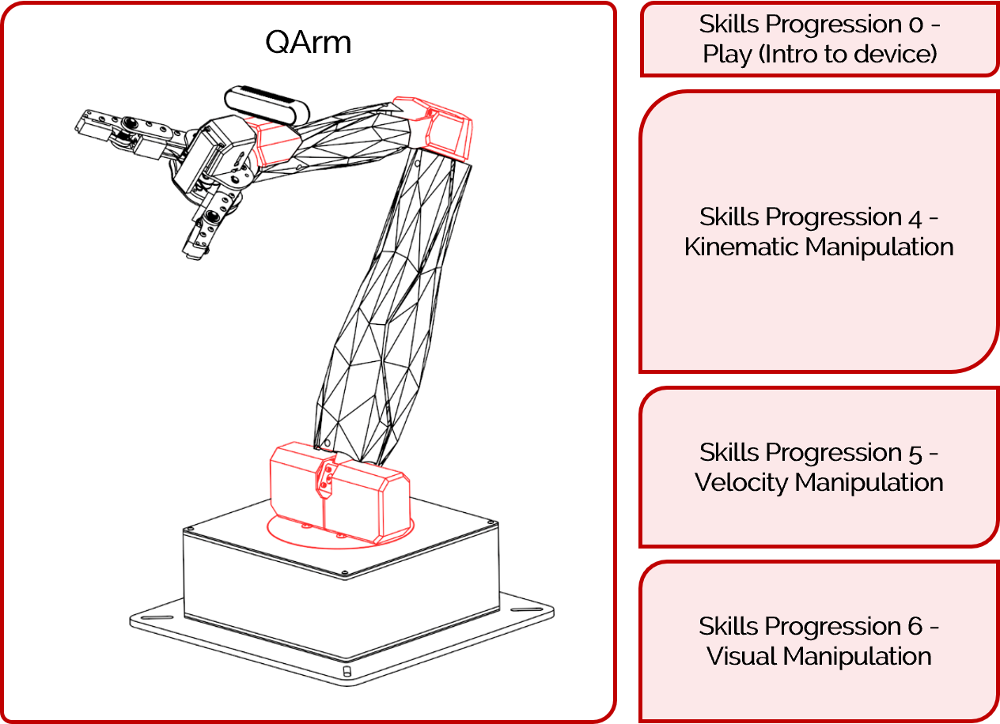
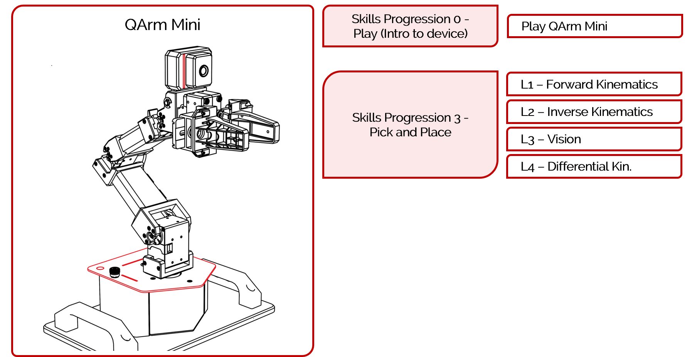
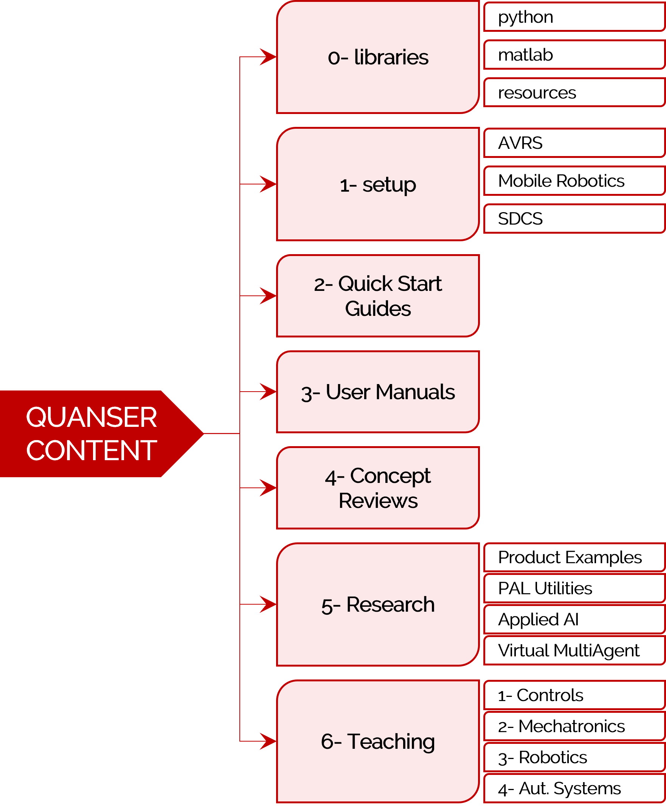

<a href="../README.md#getting-started-with-content">Back To Guide</a>
 

Before going through this guide, make sure you have downloaded our resources and have set up your computer by following the steps [here](../README.md#downloading-resources). 

This guide walks you through:
- [Getting Started With Quanser's Lab Products](#labs)
- [Getting Started With Other Quanser Solutions](#solutions)
- [Using the Provided Curriculum](#curriculum)
- [Quanser's Directory Structure](#directory-structure)

For setup for a product that is part of the labs listed below, see the [Getting Started With Labs](#labs) section.

    - Autonomous Vehicles Research Studio (AVRS):
        - QDrone, QDrone 2, QBot 2, QBot 2e
    - Mobile Robotics Lab (MRL):
        - QBot Platform, QArm Mini (If you only have QArm Mini, see the section below).
    - Self Driving Car Studio (SDCS):
        - QCar, QCar 2
    - Mechatronics Design Lab (MDL): 
        - Mechatronic Sensors Trainer, Mechatronic Actuators Trainer

For setup for any other solution listed below, please refer to the [Getting Started With Other Solutions](#solutions) section.

    - Aero 2
    - QArm
    - Qube-Servo 3
    - QArm Mini

For any other product, see [Resources For Older Products](../README.md#resources-for-older-products).

# Getting Started With Quanser's Lab Products

This guide walks you through getting started with the following labs/products: 

- [Autonomous Vehicles Research Studio (AVRS)](#avrs): 
    - QDrone, QDrone 2, QBot 2, QBot 2e
- [Mobile Robotics Lab (MRL)](#mrl):
    - QBot Platform, QArm Mini (if you only have QArm Mini, go to [Getting Started With Other Solutions](#solutions))
- [Self Driving Car Studio (SDCS)](#sdcs):
    - QCar, QCar 2
- [Mechatronics Design Lab (MDL)](#mdl): 
    - Mechatronic Sensors Trainer, Mechatronic Actuators Trainer

**_For any other product not listed above, please visit the Quanser Website for [resources](https://www.quanser.com/resources/)._**

## AVRS

The Autonomous Vehicle Research Studio (AVRS) is a research only lab that mainly uses MATLAB/Simulink as the development environment. The steps to get started after having set up your computer are as follows:

1. Go through the setup steps located in `1_setup/autonomous_vehicles_research_studio`.
2. Go through the user manual of the device you are using, located under `3_user_manuals`, for more detailed information on using the device. 
3. Find available examples under `5_research/autonomous_vehicles` for the device you are using. 

For a more detailed description of the provided file directory, go to the [Directory Structure](#directory-structure) section.

**Note:** If needed, use the [Simulink Onramp](https://matlabacademy.mathworks.com/details/simulink-onramp/simulink), for help getting started with Simulink, or the [QUARC Demos](https://docs.quanser.com/quarc/documentation/quarc_demos.html) for help getting started with Quanser's QUARC. 

[Back to Top](#)   |   [Back to Guide](../README.md#getting-started-with-content)

## MRL

The Mobile Robotics Lab (MRL) is a teaching and research lab for mobile robots. The steps to get started after having set up your computer are as follows:

1. Go through the welcome guide located in `1_setup/mobile_robotics`.

2. Run through the quick start guides of the products you have to make sure your hardware is functioning as expected. These files are located under `2_quick_start_guides/qbot_platform` and `2_quick_start_guides/qarm_mini` and are separated by hardware and virtual devices as well as by programming language (MATLAB/Python). Note that also individual IO tests are located in the product folder under `5_research`.
3. Review the User Manuals under `3_user_manuals/`, these will guide you through how to use your system, including interfacing of hardware and software. 
4. If you are using the systems for research, content is located under `5_research` under individual product folders. This content includes MATLAB, Python and ROS examples. 
5. If you are using the systems for teaching, content is located under `6_teaching/3_Robotics`. The content for each of the products is shown below as well as their corresponding skills progressions. For more information about the structure of lab content, see [Using the Provided Curriculum](#curriculum) at the bottom of this document. 

    

For a more detailed description of the provided file directory, go to the [Directory Structure](#directory-structure) section.

**Note:** If needed, use the [Simulink Onramp](https://matlabacademy.mathworks.com/details/simulink-onramp/simulink), for help getting started with Simulink, or the [QUARC Demos](https://docs.quanser.com/quarc/documentation/quarc_demos.html) for help getting started with Quanser's QUARC. 

[Back to Top](#)   |   [Back to Guide](../README.md#getting-started-with-content)

## SDCS

The Self Driving Car Studio (SDCS) is a teaching and research lab for self driving using QCar. The steps to get started after having set up your computer are as follows:

1. Go through the welcome guide located in `1_setup/self_driving_car_studio`.

2. If you have QCar 2, run through the quick start guide  to make sure your hardware is functioning as expected. These files are located under `2_quick_start_guides/qcar2`. Note that also individual IO tests are located in the product folder under `5_research`.
3. Review the User Manuals under `3_user_manuals/`, read the user manuals for your QCar version (qcar or qcar2), as well as the user manual for the traffic light if you are going to be using it with your system. These will guide you through how to use your system, including interfacing of hardware and software. 
4. If you are using the systems for research, content is located under `5_research/sdcs`, it will have IO and research examples for all products of this lab. This content includes MATLAB, Python and ROS examples. Note that the full self driving examples are part of the teaching content.
5. If you are using the systems for teaching, content is located under `6_teaching/3_Robotics`. The self driving content available as part of skills progressions is shown below. For more information about the structure of lab content, see [Using the Provided Curriculum](#curriculum) at the bottom of this document.

    

For a more detailed description of the provided file directory, go to the [Directory Structure](#directory-structure) section.

**Note:** If needed, use the [Simulink Onramp](https://matlabacademy.mathworks.com/details/simulink-onramp/simulink), for help getting started with Simulink, or the [QUARC Demos](https://docs.quanser.com/quarc/documentation/quarc_demos.html) for help getting started with Quanser's QUARC. 

[Back to Top](#)   |   [Back to Guide](../README.md#getting-started-with-content)

## MDL

The Mechatronic Design Lab (MRL) is a teaching lab for sensors and actuators. The steps to get started after having set up your computer (Windows or Raspberry Pi) are as follows:

1.  Run through the quick start guides of the products you have to make sure your hardware is functioning as expected. These files are located under `2_quick_start_guides/mech_actuators_trainer` and `2_quick_start_guides/mech_sensors_trainer`. Note that also individual IO tests and python examples are located in the product folder under `5_research`. 
2. Review the User Manuals under `3_user_manuals/mech_actuators_trainer` and `3_user_manuals/mech_sensors_trainer` for more detailed information on the device. 
3. You can also see examples in `5_research/mechatronic_trainers` that use each of the devices individually or together to understand how to do more complicated things that are not part of the fundamental labs.
4. Teaching content is located under `6_teaching/2_Mechatronics/`. The content for each of the products is shown below as well as their corresponding skills progressions. For more information about the structure of lab content, see [Using the Provided Curriculum](#curriculum) at the bottom of this document.

    

For a more detailed description of the provided file directory, go to the [Directory Structure](#directory-structure) section.

[Back to Top](#)   |   [Back to Guide](../README.md#getting-started-with-content)

# Getting Started With Other Quanser Solutions

This section walks you through getting started with the following products: 

- [Qube-Servo 3](#qube-servo-3) - Also called Intro to Controls Teaching Lab
- [Aero 2](#aero-2)
- [QArm](#qarm)
- [QArm Mini](#qarm-mini) - Also called Intro to Robotics Teaching Lab

## Qube-Servo 3

The Qube-Servo 3 curriculum is written in MATLAB/Simulink and is broken down into a list of 7 pipelines in total with more than 16 labs.

Follow these steps to get started with your Qube:

1. Run through the quick start guide of your Qube-Servo 3 to make sure your hardware is functioning as expected. These files are located under `2_quick_start_guides/qube_servo3` and are separated by programming language (MATLAB/Python). Note that also individual IO tests and python examples are located in the product folder under `5_research`. 
2. Go through the user manual located under `3_user_manuals/qube_servo3`, for more detailed information on the device. 
3. Teaching content is located under `6_teaching/1_Controls/Qube_Servo_3`. The content for the Qube-Servo 3 is shown below. For more detailed information on these skills progressions, refer to the curriculum pipeline document under the `6_teaching/1_Controls/Qube_Servo_3` directory.  For more information about the structure of lab content, see [Using the Provided Curriculum](#curriculum) at the bottom of this document.

    

For a more detailed description of the provided file directory, go to the [Directory Structure](#directory-structure) section.

**Note:** If needed, use the [Simulink Onramp](https://matlabacademy.mathworks.com/details/simulink-onramp/simulink), for help getting started with Simulink, or the [QUARC Demos](https://docs.quanser.com/quarc/documentation/quarc_demos.html) for help getting started with Quanser's QUARC. 

[Back to Top](#)   |   [Back to Guide](../README.md#getting-started-with-content)

## Aero 2

The Aero 2 curriculum is written in MATLAB/Simulink and has 10 labs for the 1DOF Pitch configuration of the device as well as 3 labs each for the advance configurations of 2DOF Helicopter and Half-Quadrotor. 

Follow these steps to get started with your Aero:

1. Run through the quick start guide of your Aero 2 to make sure your hardware is functioning as expected. These files are located under `2_quick_start_guides/aero2` and are separated by hardware and virtual devices. 
2. Go through the user manual located under `3_user_manuals/aero2`, for more detailed information on the device. 
3. Teaching content is located under `6_teaching/1_Controls/Aero_2`. The content for the Aero 2 is shown below.  For more information about the structure of lab content, see [Using the Provided Curriculum](#curriculum) at the bottom of this document.
4. For more advanced examples as well as Python examples, refer to the product folder under `5_research`. 

For a more detailed description of the provided file directory, go to the [Directory Structure](#directory-structure) section.

**Note:** If needed, use the [Simulink Onramp](https://matlabacademy.mathworks.com/details/simulink-onramp/simulink), for help getting started with Simulink, or the [QUARC Demos](https://docs.quanser.com/quarc/documentation/quarc_demos.html) for help getting started with Quanser's QUARC. 

[Back to Top](#)   |   [Back to Guide](../README.md#getting-started-with-content)

## QArm

The QArm curriculum is written in MATLAB/Simulink and has over 10 labs divided in 3 skills progressions. 

Follow these steps to get started with your QArm:

1. Run through the quick start guide of your QArm to make sure your hardware is functioning as expected. These files are located under `2_quick_start_guides/qarm` and are separated by hardware and virtual devices. 
2. Go through the user manual located under `3_user_manuals/qarm`, for more detailed information on the device. 
3. Teaching content is located under `6_teaching/3_Robotics`. The content for the QArm is shown below. For more information about the structure of lab content, see [Using the Provided Curriculum](#curriculum) at the bottom of this document.
4. For more advanced examples as well as Python examples, refer to the product folder under `5_research`. 

For a more detailed description of the provided file directory, go to the [Directory Structure](#directory-structure) section.

**Note:** If needed, use the [Simulink Onramp](https://matlabacademy.mathworks.com/details/simulink-onramp/simulink), for help getting started with Simulink, or the [QUARC Demos](https://docs.quanser.com/quarc/documentation/quarc_demos.html) for help getting started with Quanser's QUARC. 

[Back to Top](#)   |   [Back to Guide](../README.md#getting-started-with-content)

## QArm Mini

The QArm Mini curriculum is an introductory teaching lab for robotics to learn pick and place. It is written both in MATLAB/Simulink and in Python. 

Follow these steps to get started with your QArm Mini:

1. Run through the quick start guide for your QAarm Mini to make sure your hardware is functioning as expected. These files are located under `2_quick_start_guides/qarm_mini` and are separated by programming language (MATLAB/Python). Note that also IO tests are located under `5_research/qarm_mini`.
2. Go through the user manual located under `3_user_manuals/qarm_mini`, for more detailed information on the device. 
3. For advanced examples, refer to the product folder under `5_research/qarm_mini`. 
4. Teaching content is located under `6_teaching/3_Robotics`. The content for the QArm Mini is shown below as well as their corresponding skills progressions. For more information about the structure of lab content, see [Using the Provided Curriculum](#curriculum) at the bottom of this document.

For a more detailed description of the provided file directory, go to the [Directory Structure](#directory-structure) section.

**Note:** If needed, use the [Simulink Onramp](https://matlabacademy.mathworks.com/details/simulink-onramp/simulink), for help getting started with Simulink, or the [QUARC Demos](https://docs.quanser.com/quarc/documentation/quarc_demos.html) for help getting started with Quanser's QUARC. 

[Back to Top](#)   |   [Back to Guide](../README.md#getting-started-with-content)

# Using the Provided Curriculum

For products that have curriculum, each of their labs consists of the following documentation. Note that the expected order is to start with the application guide, which will reference the concept review needed, then do the lab procedure, and finally, students answer questions about the lab in the recommended assessment:

- **Application Guides**: 
    Lab specific introduction that guides students towards why the lab is important and what they will learn as well as things they need to know before starting the lab. 
- **Lab Procedures**:
    Lab specific instruction manuals with guided steps to walk students through the lab, reflect on important considerations and take notes or screenshots and capture results.
- **Recommended Assessments**:
    Lab specific take home questionnaire that requires critical thinking and further analysis of lab results. The results from the lab procedure will be analyzed here by the student.
- **Concept Reviews**: 
    Independent reference material for student use that serves as a means for them to refresh the most important concepts and equations for any lab. These exist mostly in a separate concept_reviews folder in the Quanser folder or could be placed alongside the lab. 

[Back to Top](#)   |   [Back to Guide](../README.md#getting-started-with-content)

# Directory Structure

Quanser content is subdivided into a series of directories to help you get started quickly. 

- **0_libraries**: Source location for custom Python/Simulink libraries, as well as other useful files used in the libraries. Please review `libraries_guide` inside the libraries folder for more information.

- **1_setup**: Setup for different lab products and setup for a Raspberry Pi. 
- **2_quick_start_guides**: Standalone Quick Start Guides for various products. 
- **3_user_manuals**: PDF files of user manuals for different Quanser products.
- **4_concept_reviews**: Consists of .docx/.pdf files for background concepts utilized in Quanser Curriculum.
- **5_research**: Research and IO examples and in either Simulink/Python/ROS for different solutions provided by Quanser. (previously "examples" folder) 
- **6_teaching**: Curriculum/lab content for various Quanser products for hardware or digital twins. 

<a href="#">Back to Top</a>
 

<a href="../README.md#getting-started-with-content">Back To Guide</a>
 

