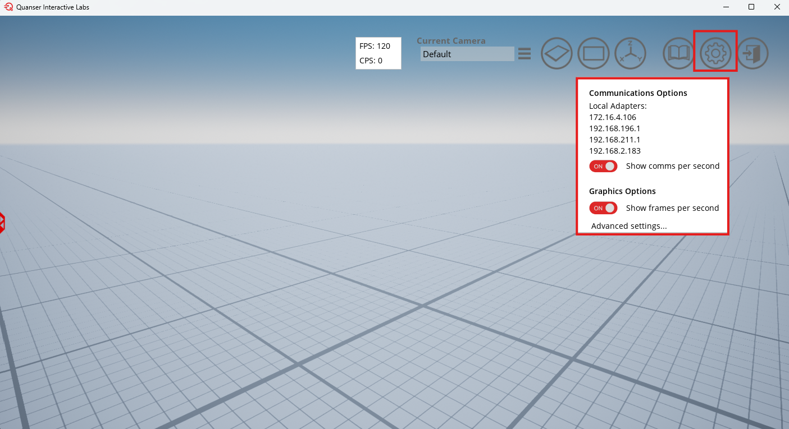
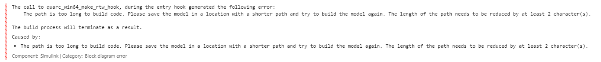

# MATLAB FAQ <!-- omit in toc -->

Common issues that get discovered will be posted here.

## List of FAQ <!-- omit in toc -->

- [💻 Software Requirements 💻](#-software-requirements-)
- [❓ FAQ ❓](#-faq-)

## How can I view my fps and cps

To view the frames per second and comms per second do the following:

- On the main page of QLabs click on settings
- Turn on 'show advanced options':

- Navigate to the Plane world in QLabs
- Turn on 'show comms per second' and 'show frames per second' in the settings:

## How can I Unlock My FPS

Navigate to the advanced settings in the QLabs Plane world:

Framerate can be unlocked or the limit can be raised, which also unlocks the communications per second (CPS) with QLabs. This determines how fast you can get data from QLabs, which is important for control algorithms.

## I'm getting a Path Limit Error in Simulink

MATLAB does not like it when the MATLAB PATH is over 260 characters. When running the self-driving stack, many files get generated with long paths. This can flag an error in the Simulink Generating Code process.

Error:

If this happens, please move the whole `/self-driving-stack-resources` folder to a shorter path.

