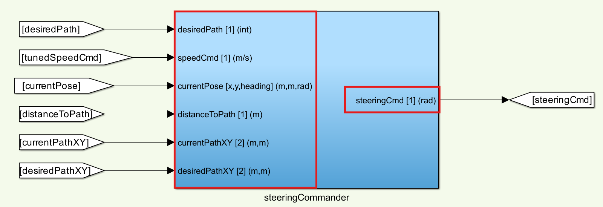
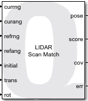
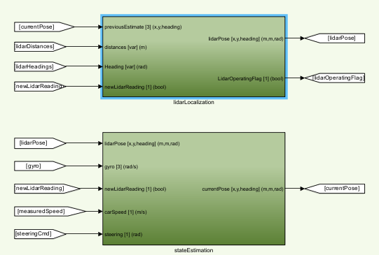

# Virtual MATLAB Development Guide 🪧 <!-- omit in toc -->

This document covers the information necessary to navigate the current self-driving stack that is provided by Quanser and eventually iterate on it.

## Topics <!-- omit in toc -->

This document will cover the following:

- [Overview of the Architecture](#overview-of-the-architecture)
- [Conventions](#conventions)
- [Localization](#localization)

## Overview of the Architecture

The self-driving stack is a resource that Quanser provides and is continuously being worked on by Quanser engineers. There are many things to improve on and the methods used are not necessarily the best, so any and **all aspects of this stack should be questioned and improved upon**.

This is a very computationally intense self-driving stack. Keep in mind that if the CPU and GPU of your computer is not powerful (see [system requirements](./Virtual_MATLAB_Software_Setup_with_QUARC.md#system-requirements)) this stack will perform significantly worse.

Here is the [guide for running the self-driving stack](./Virtual_MATLAB_Software_Setup_with_QUARC.md#running-the-self-driving-stack-resources) for reference.

## Conventions

**Goto and From Blocks:**

The self-driving stack utilizes many `goto` and `from` blocks to move signals through the model. This is because using lines becomes extremely messy when there are a large amount of signals.

**Subsystem Inports and Outports:**

There are many inports and outports to each of the subsystems within the model. To easily identify what signals are intended to be connected, the name, signal size, and units/data types are used in the following format [ `<signalName> [size] (units)` ]:

**Subsystem Colors:**

Certain colors of subsystems represent different types of self-driving components:

-  Red : I/O of the QCar hardware
-  Blue : Controllers (mainly for speed and steering)
-  Green : Interpretation of the environment
-  Orange : Decision and planning
-  Pink : Monitoring timings

## Localization

The current self-driving stack drives purely from its localization and EKF, but does not drive on any vision-based approach. The localization technique uses QUARC's `LiDAR Scan Match` block as a global localization that gets fused with other sensor information in an EKF. This generates a pose estimate that is then used to steer and follow a path.

To use the `LiDAR Scan Match` block, a scan of the environment must be completed prior to running the self-driving stack. This is why the instructions guide the user to complete a calibration scan from the center of the Quanser Roadmap. This generates a `.mat` containing a reference scan that the `LiDAR Scan Match` block use to compare against. Please see the [Documentation for the LiDAR Scan Match Block](https://docs.quanser.com/quarc/documentation/lidar_scan_match_block.html) for the full details.

The `LiDAR Scan Match` block returns the ` [x,y,heading] ` of the QCar at 15hz, which is quite slow. This then gets fused with the gyroscope, tachometer, and steering which operate at 500hz to give quicker localization inbetween the lidar scans.

