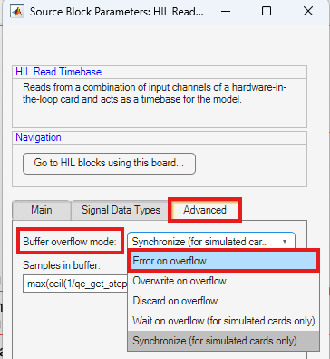
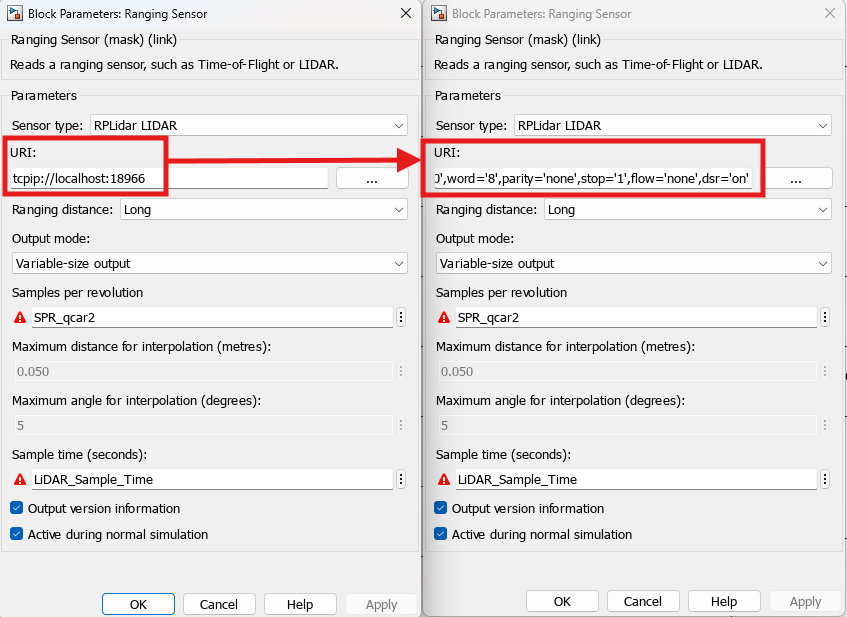
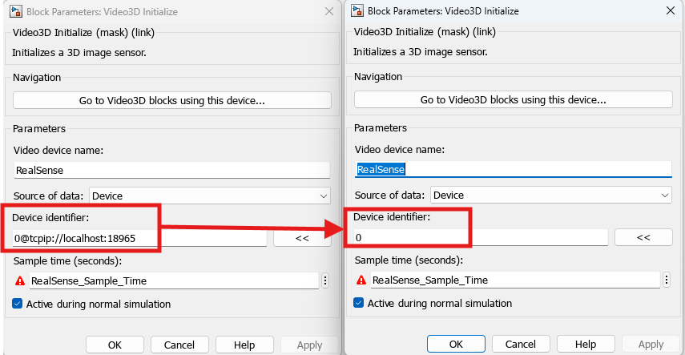
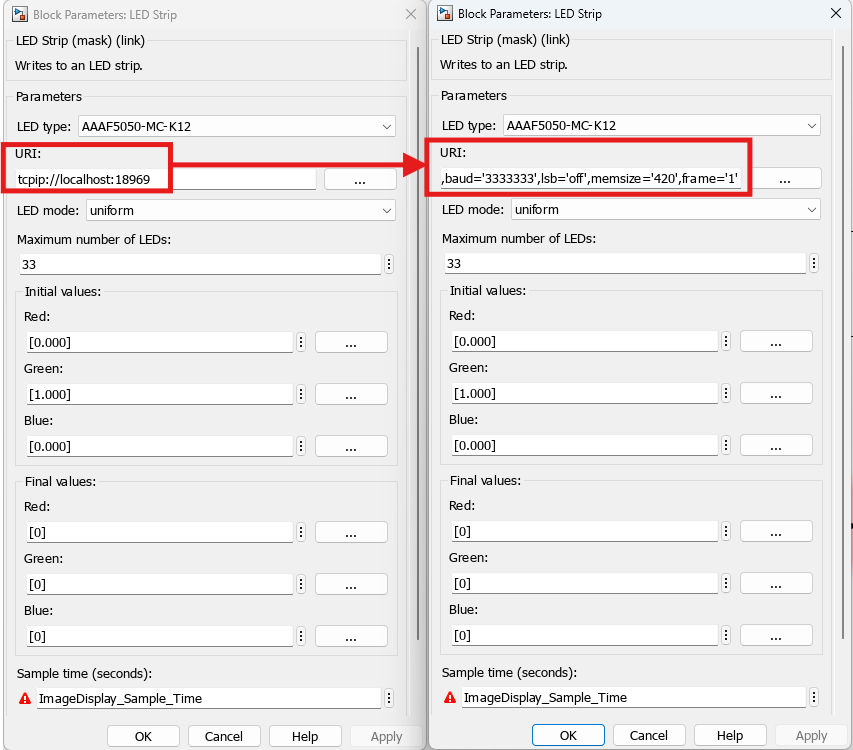
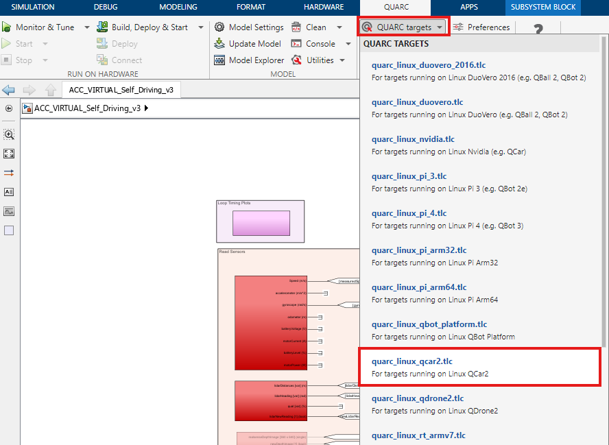
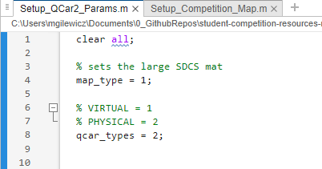

# Virtual MATLAB Software Setup 🪧 <!-- omit in toc -->

Please go through the following steps to set up a computer to use the QCar with MATLAB in Quanser Interactive Labs.

## Description <!-- omit in toc -->

This document will cover the following:

- [Steps for Virtual to Physical Conversion](#steps-for-virtual-to-physical-conversion)
- [I/O Conversion Guide](#io-conversion-guide)
  - [Quick I/O Conversion Table](#quick-io-conversion-table)
  - [HIL Initialize](#hil-initialize)
  - [HIL Read Timebase](#hil-read-timebase)
  - [Ranging Sensor](#ranging-sensor)
  - [Video3D Initialize](#video3d-initialize)
  - [Video Capture](#video-capture)
  - [LED Strip](#led-strip)
- [Switching the QUARC Target](#switching-the-quarc-target)
- [Switching the QCar2\_Params.m file](#switching-the-qcar2_paramsm-file)
- [Background Context](#background-context)

The Simulink models configured for using a physical QCar 2 are provided as:

- [PHYSICAL_self_driving_stack.slx](./self_driving_stack_resources/PHYSICAL_self_driving_stack.slx)
- [QCar2_Physical_calibrate.slx](./self_driving_stack_resources/QCar2_Physical_calibrate.slx)

## Steps for Virtual to Physical Conversion

Perform the following 3 steps to convert your Simulink model:

1. Go through the [I/O Conversion Guide](#io-conversion-guide) and ensure certain Simulink blocks have been modified correctly
2. Change the [QUARC Target and IP Address](#switching-the-quarc-target)
3. Switch [`qcar_types` the `QCar2_Params.m` file](#switching-the-qcar2_paramsm-file)

## I/O Conversion Guide

Below contains a list of the blocks that will need to be changed and what to change within the block settings.

### Quick I/O Conversion Table

This table contains the parameters you need to change, but the subsequent subsections contain screenshots.

| Simulink Block | Parameter Name | Virtual Setting | Physical Setting |
| :------------- | :------------: | :-------------: | :--------------: |
| HIL Initialize | Board identifier | 0@tcpip://localhost:18960 | 0 |
| HIL Read Timebase | (Advanced tab) Buffer overflow mode | Synchronize (for simulated cards only) | Error on overflow |
| Ranging Sensor | URI | tcpip://localhost:18966 | serial-cpu://localhost:1?baud='256000',word='8',parity='none',stop='1',flow='none',dsr='on' |
| Video3D Initialize | Device identifier | 0@tcpip://localhost:18965 | 0 |
| Video Capture (Right CSI) | Device identifier | 0@tcpip://localhost:18961 | 0 |
| Video Capture (Rear CSI) | Device identifier | 1@tcpip://localhost:18962 | 1 |
| Video Capture (Front CSI) | Device identifier | 2@tcpip://localhost:18963 | 2 |
| Video Capture (Left CSI) | Device identifier | 3@tcpip://localhost:18964 | 3 |
| LED Strip | URI | tcpip://localhost:18969 | spi://localhost:1?word='8',baud='3333333',lsb='off',memsize='420',frame='1' |

### HIL Initialize

Change `Board identifier` from `0@tcpip://localhost:18960` to `0`:

### HIL Read Timebase

Change the `Buffer overflow mode` from `Synchronize (for simulated cards only)` to `Error on Overflow`:

### Ranging Sensor

Change `URI` from `tcpip://localhost:18966` to `serial-cpu://localhost:1?baud='256000',word='8',parity='none',stop='1',flow='none',dsr='on'`

### Video3D Initialize

Change `Device identifier` from `0@tcpip://localhost:18965` to `0`:

### Video Capture

The following are the conversion is needed for each CSI Camera:

- Change `0@tcpip://localhost:18961` to `0` (Right)
- Change `1@tcpip://localhost:18962` to `1` (Rear)
- Change `2@tcpip://localhost:18963` to `2` (Front)
- Change `3@tcpip://localhost:18964` to `3` (Left)

### LED Strip

Change `URI` from `tcpip://localhost:18969` to `spi://localhost:1?word='8',baud='3333333',lsb='off',memsize='420',frame='1'`:

## Switching the QUARC Target

Change the target from a Windows Target (used for QLabs) to the QCar 2 target. To do this select the `QUARC Tab` in Simulink, then the `QUARC Targets` drop down menu, then the `quarc_linux_qcar2.tlc` target:

Change the ip address to the ip address displayed on the QCar and use port.

Example: add to MEX-file arguments `,'tcpip://192.168.55.1:17001'`

If you do not have an ip address on the LCD of the QCar, please refer to the [User Manual for Connectivity](https://github.com/quanser/Quanser_Academic_Resources/blob/dev-windows/3_user_manuals/qcar2/user_manual_connectivity.pdf).

## Switching the QCar2_Params.m file

Within the Qcar2_Params.m file change the `qcar_types` variable from 1 (for virtual) to 2 (for physical).

This will modify some of the lidar offsets so that the lidar aligns with the map and qcar body frames.

## Background Context

If you have followed the [Virtual MATLAB Software Setup Guide](./Virtual_MATLAB_Software_Setup.md), then the self-driving stack that you are developing on is configured to access virtual hardware. This is done using a special Device Identifier or URI in the `HIL Initialize`, `Ranging Sensor`, `Video3D Initialize`, `LED Strip`, and `Video Capture`. The Device Identifier or the URI contains a TCP port that communicates with QLabs to send and receive data from the simulated QCar DAC.

When converting your Simulink model from virtual to physical, you will need to change these Device Identifiers and URIs to point to the hardware instead of the virtual sensors/actuators.

You will also need to switch the target of the generated code from your Windows machine to the QCar 2, which is an Nvidia AGX Orin target. This will be addressed below.

