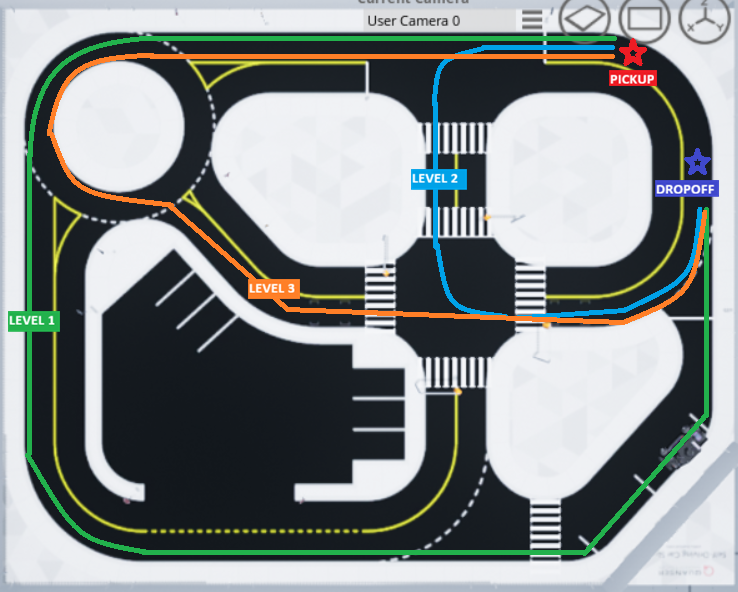

# Welcome to the Quanser MATLAB Competition Resources

This repo contains all the resources available for the Quanser MATLAB-based competitions!

## The Challenge
In this Hackathon you will be playing the role of an autonmous taxi service. Your goal is to pick up a passenger and drop them off at a specified location. You will be working off of a file that has some basic logic built into it, following the guide in XX. You may choose one of the specified paths shown below to complete the task based on the level of difficulty you are willing to take on. The car must fully function under criteria outlined below to gain the additional points.

Level 1 (+2 Points): The provided file you will be working off of comes with a predefined path that allows the car to drive around the outer track. To complete level 1, you **do not have to obey traffic signals**. Just stop within a radius of **X** at the coordinates provided for **3 seconds** for this level to be completed.

Level 2 (+6 points): You will have to define a new path for the car shown in blue while also using object detection to obey traffic signals including the stop sign and traffic light.

Level 3 (+12 points): Your car will have to navigate through a more difficult path and also avoid hitting pedestrians at the crosswalk while still stopping for the stop sign and traffic light.

## Presentation
At the end of the hackathon you will have to present your work to a panel of judges. Your presentation should be about *15 mins* and it should include:
1. Brief introduction
2. Video of your car's performance for your chosen level
3. Explanation of your logic
4. One innovative feature you think would improve your taxi service and set you apart. (Doesn't have to be implemented in your code)

The judges will be scoring you based on 3 categories: Your logic, innovative feature, and overall presentation quality. Each of these categories out of 6, which brings the presentation's maximum possible score to 18 points.
