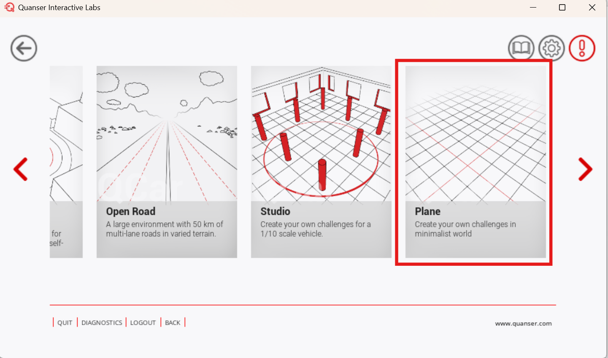
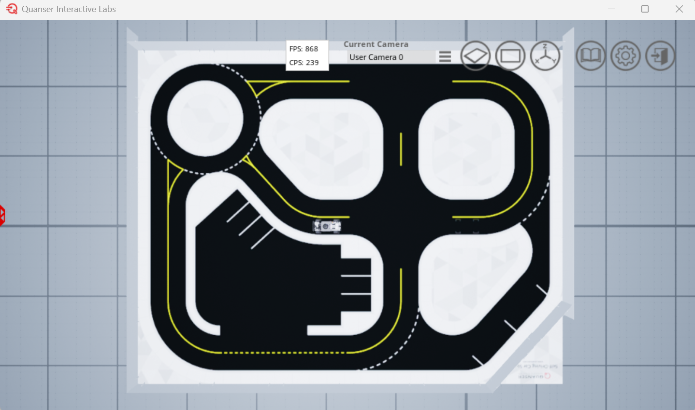
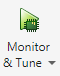

# Virtual MATLAB Software Setup 🪧 <!-- omit in toc -->

Please go through the following steps to set up a computer to use the QCar with MATLAB in Quanser Interactive Labs.

## Description <!-- omit in toc -->

This document will cover the following:

- [System Requirements](#system-requirements)
- [Setting up Quanser Interactive Labs (QLabs) with MATLAB](#setting-up-quanser-interactive-labs-qlabs-with-matlab)
- [Setting Up the MATLAB Competition Resources](#setting-up-the-matlab-competition-resources)
- [Running the Self-Driving Stack Resources](#running-the-self-driving-stack-resources)
- [MATLAB Setup Real Scenario](#matlab-setup-real-scenario)
- [Learning the Self-Driving Stack](#learning-the-self-driving-stack)

## System Requirements

`Installation Time:` It will take around **2 hours** to install everything

`Storage:`: Installing everything will consume around **45GB of storage**

`OS:` Windows 10 or 11

`MATLAB Version:` 2024a or higher

`MATLAB Toolboxes:` Simulink Coder, MATLAB Coder, and Control System Toolbox

`C++ Compiler:` [Visual Studio 2019 Community](https://quanserinc.box.com/s/ffe1ud4hikxdau9qwdlxf0ali07d1l6c) (Desktop development with C++)

`Minimum Hardware:`

- Graphics Card: Intel UHD or Intel Iris Xe integrated GPU, or equivalent
- Processor: Intel Core Ultra 5, Intel Core i5, AMD Ryzen 5, or equivalent
- Memory: 8 GB RAM

`Recommended Hardware:`

- Graphics Card: 4050m or equivalent
- Processor: i5-13500HX or equivalent
- Memory: 16 GB RAM

**Note**: Recommended hardware is based on the hardware used to develop and run self-driving stack in Simulink.

## Setting up Quanser Interactive Labs (QLabs) with MATLAB

Follow the below steps to set up QLabs with MATLAB:

WARNING: Ensure you do not already have QUARC or Quanser Interactive Labs installed on this PC (uninstall them if you do).

1. Download the [Competition License file](https://quanserinc.box.com/shared/static/q5o3t3yl5att8h4qsvzzqhkgy3chroe5.qlic)

2. Download the [QUARC 2025 SP1 Installer](https://download.quanser.com/installers/2025/install_quarc.exe)

3. Follow this guide to install QUARC 2025 SP1 (this will install QLabs): [QUARC 2025 SP1 Installation Guide](https://download.quanser.com/doc/2025sp1/QUARC_Quick_Installation_Guide_Local_License.pdf)

    - Use the license file (.qlic) you downloaded in Step 1 along with the guide

## Setting Up the MATLAB Competition Resources

**First**, the Quanser Academic Resources will be installed:
1. Install [Git](https://git-scm.com/downloads) in your system.
2. Open your **Documents** folder and open a windows terminal in that folder.
3. Run the following commands to create the Quanser directory and this UWAFT directory seperately.
    ```
    git clone https://github.com/quanser/Quanser_Academic_Resources.git Quanser
    ```
    ```bash
    git clone https://github.com/tkics/UWAFT-Software-Challenge.git
    ```

2. Run the following batch file to ensure you have installed everything correctly:

    - You are using MATLAB Virtual
    - Ignore any GitHub pages it opens up

    `C:\Users\<username>\Documents\Quanser\1_setup\step_1_check_requirements.bat`

3. Run the following batch file:

    `C:\Users\<username>\Documents\Quanser\1_setup\configure_matlab.bat`

## Running the Self-Driving Stack Resources

Follow the below instructions to make sure everything is set up correctly and learn how to use the provided resources:

1. Using MATLAB navigate to the `UWAFT-Software-Challenge/student-competition-resources-matlab/Virtual_MATLAB_Resources/self_driving_stack_resources` (make sure you double -click on folders and don't expand them)

2. Open QLabs by searching "Quanser Interactive Labs" on ur windows bar and navigate to `Self-Driving Car Studio` => `Plane`

    

3. Run the `Setup_Real_Scenario_ForStudents.m` script. This script spawns signage and traffic lights. This script runs CONTINUOUSLY in a loop to control the traffic lights, so it will need to be run in a separate MATLAB session from the `VIRTUAL_self_driving_stack_v2.slx`. To open another session of matlab, you will need to right-click on the MATLAB icon and select your version of MATLAB again.

    - Make sure the `spawn_location` variable is `1` (top of the script)

    It should look something like this after running the script:

    

5. Open `QCar2_Virtual_calibrate.slx`

6. Use 'Monitor & Tune' to run the model

    

7. Change `spawn_location` to `2` in the `Setup_Real_Scenario_ForStudents.m` script

8. Run `Setup_Real_Scenario_ForStudents.m` to spawn the QCar in the taxi hub area

9. Run `Setup_QCar2_Params.m`

10. Open `VIRTUAL_self_driving_stack_v2.slx`

11. Use 'Monitor & Tune' to run the model

    

You should see the QCar begin to complete a lap of the outside-most lane as shown below (sped up):


If something is not working correctly, please double-check that you have gone through the steps correctly. If the issue persists, check out our [MATLAB FAQ](./MATLAB_FAQ.md) or ask one of the organizers for help. 

## Learning the Self-Driving Stack

Once everything is confirmed and working, you can take a look at the [development guide](./Virtual_MATLAB_Development_Guide.md).
